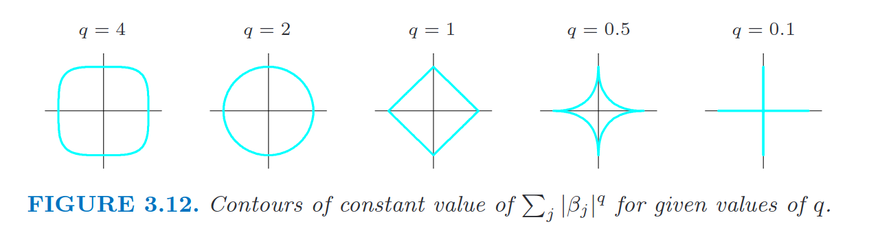

---
layout: post
title: "Experimenting on the Ridge Regularization Method"
date: 2021-09-12
categories: artificial_intelligence, machine_learning, github, mathematics, blogging
--- 

# Background and Note

For years, I've been using Markdown functionality within VS Code separately and within Wordpress.com separately. Since I maintain a blog at [AI Explorations](https://aiexplorations.in), I haven't really stepped into the process of making publishing on Github repositories (or other repositories) work for my Wordpress.com blog. Granted, I did post code, equations and so on in the past, but these were authored directly within the Wordpress.com blog. As a consequence, I haven't benefited from the comfort of working with a regular Markdown or text editor. 

Since I explored Github Pages last week, I have started up this blog at [AI Explorations Github](https://aiexplorations.github.io) and am now trying things out here, such as:
1. Mathematical equations - because we deal with a lot of mathematics and statistics in machine learning and data science
2. Diagrams - because sometimes, there is no better way to express ideas than a diagram
3. Embedding images - similarly with equations and diagrams, it is important to see visual callouts of machine learning results, data science results, and so forth.

I hope to make the skills I learn here work for the broader process of publishing books and other resources using Markdown and other such tools. These are some first steps towards that.

# Ridge Regularization

One of the commonest formulae that turn up in machine learning is the loss function. Below I've written down the loss function for a regression problem, with the $L_2$ (Ridge) regularization.

> **Note**: I've referred to the terminology used in the freely available book [Elements of Statistical Learning](https://web.stanford.edu/~hastie/ElemStatLearn/) which discusses these regression and regularization formulations in a lot of detail.

Ridge regression is a kind of _shrinkage_ method of regularizing regression models, and as the term may imply, the mechanism it employs is to shrink the coefficients by a penalty proportional to the weights. In case of Ridge regression, a penalty proportional to the square of the weights $\beta_j$ for the $j$ factors or input variables of the problem. Here, the $\beta$ coefficients are amplified by a regularization parameter $\lambda$ which can be considered a "fudge factor". The stronger $\lambda$, the higher the regularization effect when building the machine learning model.

$$ \beta_{ridge} =  argmin_{\beta} \Bigg\{ \sum_{i=1}^{N} \Big( y_i - \beta_0 - \sum_{j=1}^{p} x_{ij} \beta_j \Big)^2  + \lambda \sum_{j=1}^{p} \beta_j^2 \Bigg\} $$ (1)

Readers may already know the first part of this equation to be the error of the model, or the difference between the ground truth $y_i$ and the predicted value $\hat{y}_i$ from the ordinary least squares model. Since we know $\hat{y}_j$ to be of the form $\beta_0 + \beta_1 x_{1j} + \beta_2 x_{2j}...$ for the $j^{th}$ data point, we represent that in a simplified form in the above equation.

The Ridge regression formulation has a closed form solution (like OLS regression). We find the coefficients $\beta$ using

$$\hat{\beta}_{ridge} = \big( \boldsymbol{X^T}\boldsymbol{X} + \lambda\boldsymbol{I}  \big)^{-1}\boldsymbol{X^T}y$$ (2)

The normal equation used to find coefficients $\beta$ for ordinary least squares (OLS) is quite similar. This is possible because the loss

$$\big(\boldsymbol{Y - X}\beta \big)^T \big(\boldsymbol{Y - X}\beta \big) + \lambda \beta^T \beta$$ (3)

reduces to the normal equation (2) we see above when we aim to find the values of $\beta$ which minimize the loss above.

# Generalizing the $L_1$ and $L_2$ paradigms

In the above description of $L_2$ or Ridge regularized regression, we choose $\beta_j^2$ notably with a power of 2. The alternative regularization method (also a shrinkage technique) that's also commonly used is $L_1$ or Lasso regularization, where we substitute $|\beta_j|$ in place of $\beta_j^2$ to arrive at a different form of least squares regression. 

Now what if we were to use a hybrid of these two, and parametrize it?

What if we were to use $|\beta_j^q|$ where $q\geq1$ is an arbitrary power? This parametrization automatically encompasses the $L_1$ and $L_2$ cases. By removing the negative sign (since we use the absolute value of $\beta_j^q$) we can eliminate the potential of the regularization term to cancel out, and by adding the parameter $q$, we give the statistician some control over the extent to which the penalty will apply.

The normal equation we conveniently had above cannot be proven for $q \geq 1$. We can build approximate solutions for this problem by using stochastic gradient descent, though, since that approach provides us one more way of finding values of $\beta$ which minimize the loss below:

$$ 

\tilde{\beta} = argmin_{\beta} \Bigg\{ \sum_{i=1}^N (y_i - \beta_0 - \sum_{j=1}^p x_{ij} \beta^2 ) + \lambda\sum_{j=1}^p |\beta_j|^q  \Bigg\} 

$$ (4)

# Elastic Net Penalty and Uses

Now that we've seen how we can generalize the regularization, we may be interested in putting $q$ to the test, and using this formulation of regression everywhere. Clearly, there are situations where this is best suited, and some others may just call for OLS or other kinds of regression. 

There's a beautifully intuitive diagram in [ESL](https://web.stanford.edu/~hastie/ElemStatLearn/printings/ESLII_print12_toc.pdf) in Figure 3.12 of that book, and I reproduce it here:

As can be clearly seen here, as the value of $q$ reduces from $4$ to $0$, we see the contours of $\sum_j|\beta|^q$ also occupying smaller and smaller areas. The above describes a two-dimensional case where there are $\beta_1$ and $\beta_2$ used in the model, and we regularize a model based on these two coefficients. However, for larger feature spaces, we're likely to see higher dimensional contours from shrinkage models.

This intuition relates directly to the Elastic Net formulation. The penalty here could be described as below:

$$

\lambda \sum_{j=1}^p \big( \alpha \beta_j^2 + (1-\alpha)|\beta_j|\big)

$$ (5)

Conveniently, the above elastic net penalty can be broken down into the left part (which represents $L_2$) and the right part (representing $L_1$). This is pretty interesting exactly because it conveniently combines the best of Ridge and Lasso regression formulations.

# Concluding Remarks

What we've seen in this post is a casual saunter through different regression penalties (which I'd add is by no means extensive). In future posts, I hope to cover more aspects of the regression formulation, given the ubiquity and frequent usefulness of different regression formulations.
